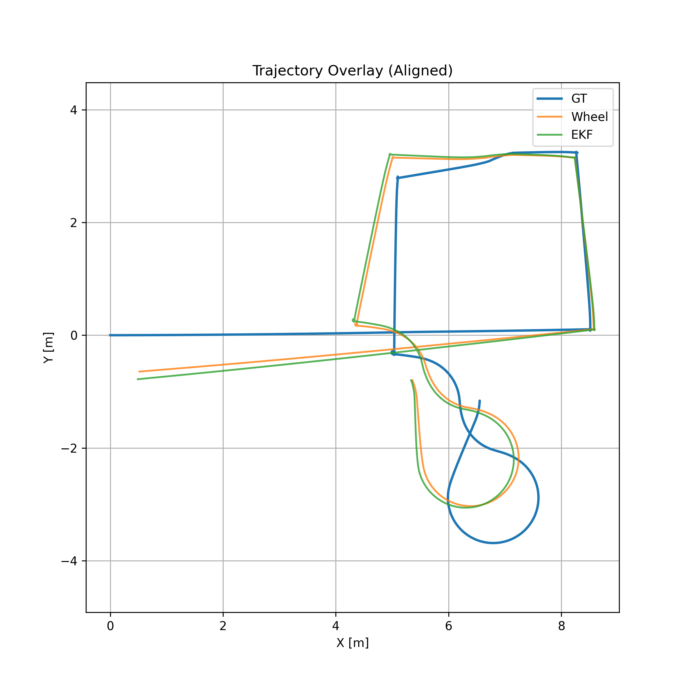
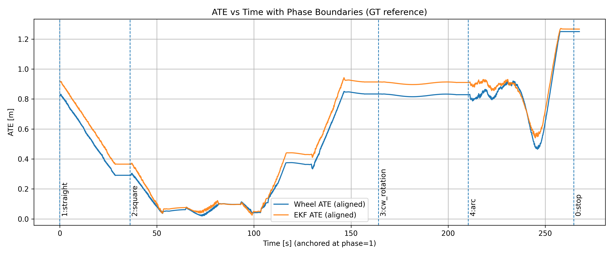
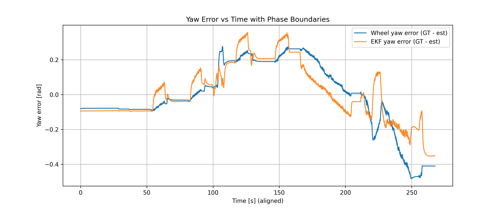

# Investigation of SLAM Methods for Autonomous Robots focused on Embedded Compatiblity
Master’s thesis project implementing and evaluating **sensor fusion and SLAM algorithms** in **NVIDIA Isaac Sim** using **ROS2**.  
The work focuses on building a **reproducible evaluation pipeline** for state estimation and SLAM systems under controlled experimental conditions.

The project investigates how **relative sensors** (wheel encoders + IMU) compare with **exteroceptive SLAM methods** in terms of:

- Trajectory accuracy  
- Drift behaviour  
- Robustness

## Project Overview

Autonomous mobile robots rely on **accurate localization** for navigation.  
Traditional odometry methods using **wheel encoders** and **IMUs** suffer from **accumulating drift**, particularly during curved trajectories or long-duration motion.

This project builds a **controlled simulation framework** to evaluate different localization approaches:

- **Wheel Odometry (baseline)**  
- **EKF Sensor Fusion (wheel + IMU)**  
- **Visual SLAM (future stage)**  
- **GPU-accelerated SLAM (future stage)**

All estimators are evaluated against **simulator ground truth** using a **reproducible benchmarking pipeline**.

## Key Features

### Deterministic Simulation Pipeline

- NVIDIA Isaac Sim environment  
- Nova Carter differential drive robot  
- ROS2 bridge integration

### Sensor Fusion

- Wheel encoder odometry  
- IMU integration  
- EKF state estimation using `robot_localization`

### Ground Truth Benchmarking

- Simulator ground truth recording  
- Strict separation between estimator and evaluation pipeline

### Automated Evaluation Framework

Metrics computed automatically:

- Absolute Trajectory Error (ATE)  
- Relative Pose Error (RPE)  
- Yaw drift analysis  
- Phase-wise trajectory evaluation

### Reproducible Experiments

All experiments follow a **locked configuration policy** ensuring **fair comparison** between estimators.

## Repository Structure

```
ros2_ws/
│
├── src/
│   └── ekf_slam_sim/
│       ├── launch/
│       ├── config/
│       ├── scripts/
│       └── nodes/
│
├── analysis/
│   ├── baseline_analysis_scripts/
│   ├── gt_evaluation_scripts/
│   └── analysis_env/
│
├── Experiment_Insights/
│   ├── BASELINE_INTERPRETATION.md
│   ├── BASELINE_GT_ANALYSIS_INTERPRETATION.md
│   └── EXPERIMENT_LOCK_POLICY.md
│
├── bags/
│   ├── traj_with_cam_records/
│   └── traj_without_cam_records/
│
├── Implementation_READMEs/
│   ├── Phase_1/
│   └── Phase_2/
│
│
└── README.md
```

## Simulation Architecture

The estimation framework follows this structure:

```
Wheel Encoders + IMU
        ↓
    EKF State Estimator
        ↓
    Odometry Estimate
        ↓
Offline Evaluation vs Ground Truth
```

> **Note:** Ground truth is recorded independently from the simulator and **never used by the estimator during runtime**.

## TF Architecture

The system follows a strict transform policy:

```
odom
  └── chassis_link
        ├── camera_link
        ├── imu_link
        └── lidar_link
```

**Rules:**

- Only one node publishes `odom → chassis_link`  
- Sensor frames remain **static** under `chassis_link`  
- Simulator **world frame** is never used by the estimator  

## Experimental Datasets

**Canonical trajectory command bag:** `traj_cmd_clean_v1`  

**Trajectory phases:**

| Phase | Motion                  |
|-------|------------------------|
| 0     | Stop                   |
| 1     | Straight               |
| 2     | Square                 |
| 3     | Clockwise rotation     |
| 4     | Arc                    |

**Ground truth dataset:** `run_gt_eval_v1`  

**Topics recorded:**

```
/gt/odom
/traj_phase
```

## Baseline Experiments

Two estimators were evaluated:

### 1. Wheel Odometry

- Wheel encoder integration without sensor fusion  
- **Dataset:** `run_wheel_only_v2`

### 2. EKF Fusion

- Wheel + IMU fusion using `robot_localization`  
- **Dataset:** `run_ekf_baseline_v2`

---

## Evaluation Metrics

The evaluation pipeline computes:

- **Absolute Trajectory Error (ATE):** Measures global deviation from ground truth  
- **Relative Pose Error (RPE):** Measures short-term drift over fixed time intervals  
- **Yaw Error:** Quantifies heading drift accumulation  
- **Phase-wise Metrics:** Trajectory performance evaluated per motion phase  

---

## Baseline Results

| Estimator       | ATE RMSE |
|-----------------|-----------|
| Wheel Odometry  | ~0.63 m   |
| EKF Fusion      | ~0.69 m   |

**Observations:**

- EKF improves **rotational smoothness**  
- EKF reduces **yaw noise**  
- Absolute drift remains similar due to reliance on **relative sensors**  
- Curved motion phases produce the **highest drift**

---

## Evaluation Pipeline

Evaluation is performed offline using Python scripts located in:

```
analysis/gt_evaluation_scripts/
```

**Pipeline stages:**

```
ROS bag
    → trajectory extraction
    → timestamp synchronization
    → SE(2) trajectory alignment
    → metric computation
    → phase segmentation
    → visualization
```

**Generated outputs include:**

- `trajectory_overlay.png`



- `ate_vs_time.png`


  
- `yaw_error_vs_time.png`



- `final_summary_table.csv`

| Estimator | Phase   | ATE_RMSE | Yaw_mean |
|-----------|---------|----------|----------|
| wheel     | straight| 0.54 m   | 0.079 rad|
| ekf       | straight| 0.62 m   | 0.093 rad|
| wheel     | square  | 0.41 m   | 0.128 rad|
| ekf       | square  | 0.46 m   | 0.145 rad|
| wheel     | arc     | 0.88 m   | 0.26 rad |
| ekf       | arc     | 0.92 m   | 0.17 rad |

---

## Running the Simulation

Build the workspace:

```bash
colcon build
source install/setup.bash
```

Launch the simulation:

```bash
ros2 launch ekf_slam_sim warehouse_sim.launch.py
```

Terminal 1 – ROS2 Bag Playback:

- Plays the canonical trajectory command bag to drive the robot simulation.
- Example command:

```bash
ros2 bag play traj_cmd_clean_v1
```

## Experiment Lock Policy

To ensure **fair comparison** between estimators, the following are **fixed**:

- Robot model  
- Sensor configuration  
- Physics parameters  
- TF architecture  
- Trajectory dataset  
- Evaluation pipeline  

> **Note:** Only the **estimator algorithm** may change.

Full details are documented in:

```
Experiment_Insights/EXPERIMENT_LOCK_POLICY.md
```

---

## Current Status

**Completed:**

- Wheel odometry baseline  
- EKF sensor fusion baseline  
- Ground truth dataset generation  
- Evaluation pipeline  
- Phase-wise error analysis  

**Next stage:**

- Camera pipeline validation  
- Visual SLAM integration  
- ORB-SLAM evaluation  
- cuVSLAM comparison  

---

## Versioning

Stable experiment milestone:

```
git tag v1.0-gt-baseline-lock
```

---

## Author

**Harish Prabhu**  
Master’s Thesis – Robotics / Autonomous Systems
